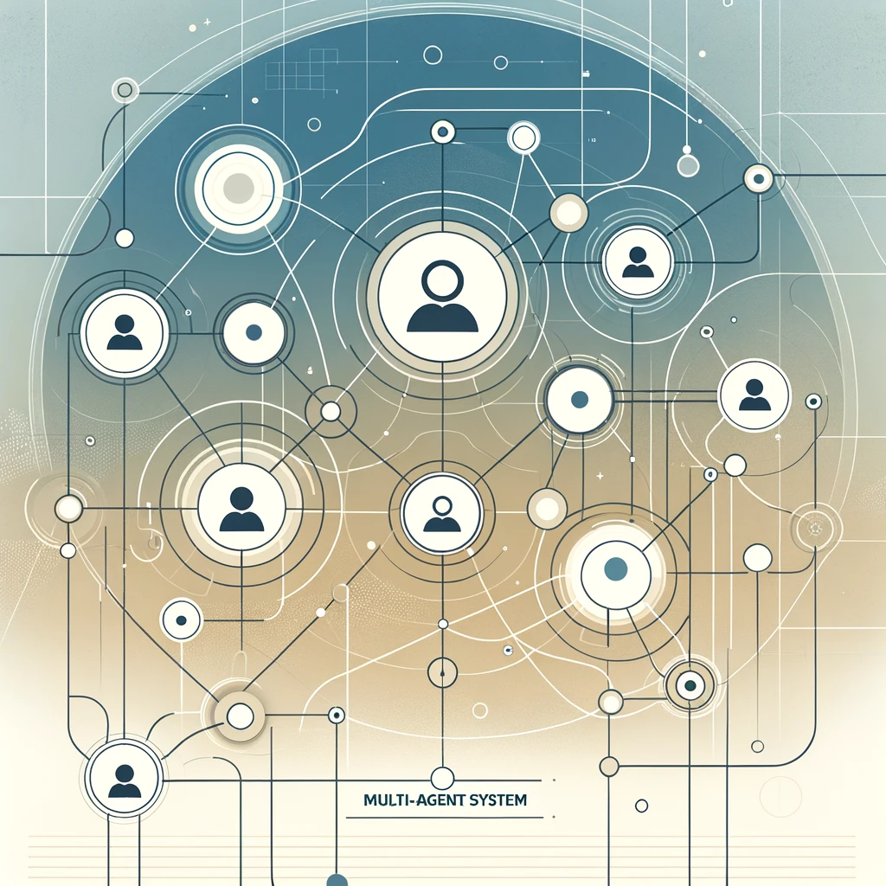

ADAM Matthias  
DEGUT Julian

# Projet Système Multi-Agents

## Description

Au travers de ce projet, nous voulons nous intéresser au fonctionnement d'un groupe d'agents au sein d'un environnement.

Ces agents spécialisés dans la négociation évoluent dans un système d'enchères et de stratégies.
En effet, nous modélisons ici **trois types d'agents différents** : 
- **Buyer** : cet agent cherche un ticket pour se rendre à une destination précise, il est muni d'un certain budget et attend de recevoir des offres pour sa destination souhaitée.
- **Supplier** : cet agent possède un ticket vers une certaine destination, il souhaite en recevoir un certain prix et suit une certaine stratégie pour négocier du prix de vente, cet agent attend de recevoir une offre pour procéder à une négociation.
- **Negotiator** : cet agent s'intéresse au marché de son environnement, c'est-à-dire qu'il regarde les destinations souhaitées par les Buyer et les destinations proposées par les Suppliers, à partir de là il suit sa propre stratégie et tente d'obtenir un billet au meilleur prix via le Supplier avant d'aller vendre ce ticket au Buyer demandant la destination.

A partir de cette construction d'environnement, nous pouvons ainsi via multi-threading modéliser le comportement d'un ensemble d'individus ayant chacun une tâche et un rôle évoluer dans un environnement concurrentiel, stratégique et négociateur.

Plus d'informations concernant le comportement précis de ces agents sont à retrouver plus loin ci-dessous.

Comme dit précédemment, les agents Negotiator et Supplier suivent des stratégies, ces stratégies sont différentes et permettent de modéliser divers comportements entre les agents.
Nous avons imaginé et créer 4 stratégies différentes, que l'on associe aléatoirement aux agents créés :
- **Boomerang** : cette stratégie consiste à étudier le comportement de son adversaire et de le copier dans ses décisions
- **GRDT** : cette stratégie vise à économiser le plus d'argent possible sans pour autant rompre la négociation.
- **JTMB** : cette stratégie vise à être le plus indulgent possible vis-à-vis de son adversaire sans pour autant se faire arnaquer.
- **SSS** : cette stratégie vise à toujours proposer des marges moins importantes que son adversaire.  

Il est important de noter que malgré l'aspect concurrentiel de notre environnement, les agents doivent avoir un minimum de collaboration pour parvenir au besoin final qui est le passage du ticket du Supplier vers le Buyer par l'intermédiaire du Buyer.  

Plus d'informations concernant le fonctionnement précis des stratégies sont à retrouver plus loin ci-dessous.

Les Negotiator peuvent aussi réaliser des coalitions afin de profiter de prix plus intéressants auprès des Supplier. Pour cela, il prennent compte l'état du marché et réalisent chacun indépendemment la décision de rejoindre la coalition ou non.  
La décision reste un minimum stochastique afin de proposer une certaine diversité dans les choix.

## Utilité des Classes

### Dossier Agent

- **Agent** : Classe mère modélisant les agents et toutes les fonctions et paramètres que ceux-ci ont en commun.
- **Buyer** : Hérite de Agent, modélise le comportement d'un Buyer avec ses paramètres et fonctions appropriés.
- **Negotiator** : Hérite de Agent, modélise le comportement d'un Negotiator avec ses paramètres et fonctions appropriés.
- **Supplier** : Hérite de Agent, modélise le comportement d'un Supplier avec ses paramètres et fonctions appropriés.

### Dossier Env

- **AnsiColors** : Utilisé pour l'affichage des messages et l'ajout de couleurs dans les messages.
- **CitiesCompanies** : Utilisé pour gérer les villes de départ et d'arrivée des tickets, ainsi que les compagnies aériennes.
- **Environnement** : Création de l'environnement et des agents y évoluant.
- **Negotiation** : Utilisé pour gérer et simuler une négotiation du début jusqu'à la fin et en appliquant les stratégies des agents concernés.
- **Ticket** : Objet échangé et négocié par les agents, contient une ville de départ, d'arrivée, un prix de base (avant négociation) et une compagnie aérienne.

### Dossier Strategy

- **Strategy** : Classe mère modélisant les stratégies et toutes les fonctions et paramètres que celles-ci ont en commun.
- **StrategyBoomerang** : Hérite de Strategy, modélise les décisions de la stratégie Boomerang avec ses fonctions appropriées.
- **StrategyGRDT** : Hérite de Strategy, modélise les décisions de la stratégie GRDT avec ses fonctions appropriées.
- **StrategyJTMB** : Hérite de Strategy, modélise les décisions de la stratégie JTMB avec ses fonctions appropriées.
- **StrategySSS** : Hérite de Strategy, modélise les décisions de la stratégie SSS avec ses fonctions appropriées.

Cette structure de notre projet permet non seulement de réaliser des changements efficacement en cas de problèmes ou de besoins nécessaires, mais aussi une implémentation relativement aisée d'un nouvel agent ou d'une nouvelle stratégie.

## Fonctionnement détaillé des agents et stratégies

### Agents

Tous les agents sont composés d'un id (unique), d'un nom, de l'environnement dans lequel ils évoluent, de la stratégie qu'ils appliquent (Negotiator + Supplier) et d'un budget (money).
Au sein de l'environnement, les agents sont crées avec un nom, stratégie et budget aléatoire.
Une fois leur tâche terminée, les agents appelent la fonction deleteItself() qui les supprime de l'environnement.

#### Buyer

[Tant que] le Ticket n'a pas été acheté :
..Attendre de recevoir une offre.  
..Si une offre est arrivée :  
....Regarder si le prix de l'offre nous convient.  
....Si le prix est acceptable : accepter l'offre et indiquer au Negotiator qu'on accepte le deal.  
....Sinon : Refuser l'offre et augmenter le prix maximum auquel on accepte un Ticket de 6%.  
..Fin [tant que]  
Suppression de l'agent.  

#### Negotiator

[Tant que] le Buyer n'a pas accepté notre offre :  
..Regarder les demandes des Buyer et les offres des Supplier.  
..Match les offres pour trouver les meilleurs deals (et les lister).  
..Si il n'y a plus aucun deal disponible, supprimer l'agent.  
..Mélanger tous les deals (pour ne pas avoir tous les Negotiator sur le même Supplier).  
..2eme [Tant que] le Supplier n'a pas accepté notre offre :  
....Prendre le premier Supplier de notre liste de deals.  
....Faire une première offre en fonction de notre budget.  
....Attendre la réponse du Supplier (qui va entamer une négociation de son côté).  
....Si le Supplier a refusé, le retirer de la liste de deals.  
....Si la liste de deals est vide, revenir au premier [Tant que].  
....Si le Supplier a accepté, fin du 2eme [Tant que].  
..Fin 2eme [Tant que].  
..Récupérer le Buyer qui est intéressé par le Ticket que l'on vient de récupérer.  
..Faire une offre à ce Buyer.  
..Si le Buyer n'existe plus, c'est qu'il a accepté une offre d'un autre Negotiator, revenir au premier [Tant que].  
..Sinon, attendre la réponse du Buyer.  
..Si le Buyer accepte, la tâche est terminée, l'agent peut être supprimé.  
..Si le Buyer refuse, refaire une proposition en réduisant l'offre de 6%.
..Fin [Tant que]  

#### Supplier

[Tant que] le Ticket n'a pas été vendu :  
..Attendre des offres de Negotiator.  
..Si on a 5 offres ou que l'on attend 2 secondes :  
..[Pour] chaque offre reçue :  
....Engager une négociation avec le Negotiator.  
....Si la négociation n'a pas aboutie, indiquer au Negotiator que l'on a refusé son offre.  
....Si la négociation a aboutie, l'ajouter à la liste des offres possibles à accepter.   
....Fin [Pour]  
..Si la liste des offres possibles à accepter est vide, revenir au [Tant que].  
..Récupérer l'offre possible à accepter proposant le meilleur prix.    
..Indiquer à tous les autres Negotiator que l'on refuse leur offre.  
..Indiquer au Negotiator concerné que l'on accepte son offre.  
..Fin [Tant que]  
Suppression de l'agent.  

### Stratégies 

Notes : 
- toutes les stratégies implémente de l'aléatoire, pour éviter d'une part une certaine redondance, et d'une autre part pour empêcher un agent de découvrir la stratégie d'un autre pour s'adapter à celle-ci, l'aléatoire est donc utilisé ici comme atout de diversité et de sécurité.
- les stratégies sont séparées en deux selon si l'agent appliquant celle-ci est un Supplier ou un Negotiator. En effet les décisions et marges appliquées sont légèrement différentes selon le type de l'agent.
- **dealAccepted()** : fonction indiquant si l'agent refuse de continuer la négociation car les prix sont trop hauts / bas.  
- **updatePrice()** : fonction réalisant la décision de la stratégie et proposant la nouvelle offre de l'agent.  

#### Boomerang

- **dealAccepted()** : si la nouvelle offre est 2 fois plus / moins importante que l'offre initiale, se retirer de la négociation.  
- **updatePrice()** : calculer la différence entre notre offre précédente et celle fait par notre adversaire, la diviser par un facteur aléatoire entre 0.5 (*2) et 3, prendre notre offre précédente et proposer une marge du delta précédent divisé par le facteur aléatoire.  

#### GRDT

- **dealAccepted()** : si la nouvelle offre est 1.5 fois plus / moins importante que l'offre initiale, se retirer de la négociation.  
- **updatePrice()** : calculer la différence entre notre offre précédente et celle faite par notre adversaire, 20% de chance de la multiplier par un facteur aléatoire entre 1.5 et 3, 80% de la diviser par ce facteur (comportement stochastique) et proposer une marge du résultat trouvé.  

#### JTMB

- **dealAccepted()** : si la nouvelle offre est 4 fois plus / moins importante que l'offre initiale, se retirer de la négociation.  
- **updatePrice()** : calculer la différence entre notre offre précédente et celle faite par notre adversaire, tenter de la prédire en parallèle (marge aléatoire entre 5 et 25%), si la différence réelle est plus important que la différence prédite, alors proposer une marge 2 à 4 fois plus importante (récompense), sinon proposer une marge 0.8 à 1.2 fois l'importance (car l'adversaire n'a pas été assez fair-play à notre goût dans la négociation).   

#### SSS

- **dealAccepted()** : si la nouvelle offre est 1.5 fois plus / moins importante que l'offre initiale, se retirer de la négociation.  
- **updatePrice()** : calculer la différence entre notre offre précédente et celel faite par notre adversaire, prendre aléatoirement 50 à 90% de celle-ci et l'appliquer à notre nouvelle offre par rapport à la précédente.  

### Coalition

Les Negotiator peuvent réaliser un état des lieux de la situation de l'environnement afin de calculer une probabilité de succès de leur mission.  
Plus la probabilité de succès est basse, plus les Negotiator auront tendance à vouloir former une coalition, si c'est le cas, alors ils bénéficieront d'une baisse de 10% sur le prix minimal que le Supplier souhaite recevoir lors d'une négociation.  